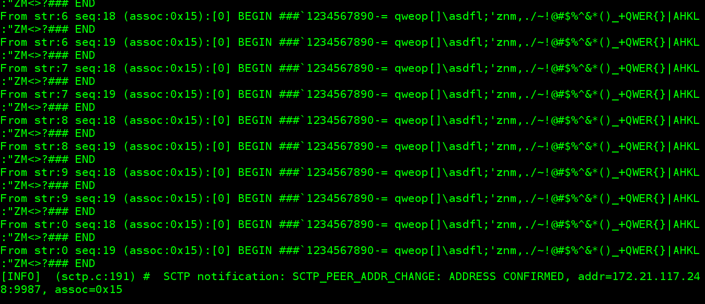
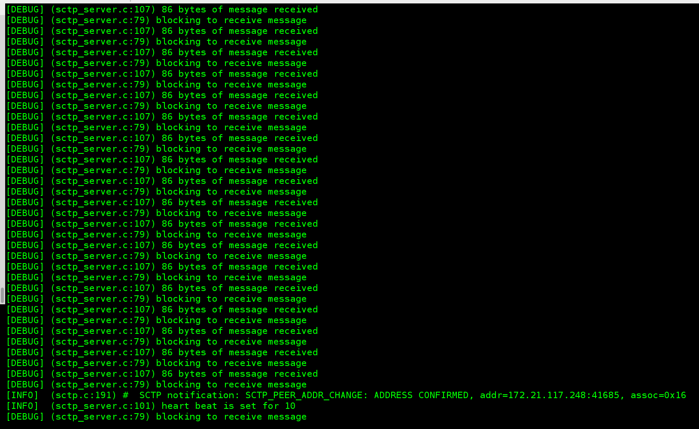

# Practice SCPT

## Pre-requisite

#### First we need sctp

* Fedora
``sudo yum install lksctp\*``

* Debian/Ubuntu
``sudo apt-get install libsctp-dev lksctp-tools``

#### Second we need libsnp

``git clone https://github.com/schwannden/libsnp``

``cd libsnp``

``make``

``sudo make install``

For those system whose ``LD_LIBRARY_PATH does not contain /usr/local/lib
and libsctp or libsnp is installed in /usr/local/lib

``source environment-setup``

#### Compile
``make``

There are currently 6 logging levels, that can be set during compilation

``LOG_LEVEL=n make``

where n could be
* 0: no logging
* 1: only error messgaes
* 2: warning messages and above
* 3: infomative messages and above
* 4: debug messages and above
* 5: all messages, same as above

For example, the default is

``LOG_LEVEL=3 make``

Which will generate all informative, error, and warning messages.

#### Running Server
Bing server to all local addresses

``./server``

Bind server to address set

``./server addr1 addr2 ... addrn``

#### Running Client
Sending messahe to specified stream

``./client server_address``

Sending message to all streams

``./client server_address all``

#### Testing
A testing mesage file called ``msg`` conntaining message begin with ``BEGIN ###`` and end with ``### END`` can be used as follows

First start the server

Test client by

On the client side, you should see

On the server side, you should see

Shut down client by ctrl+\, and on the server side, you should see

